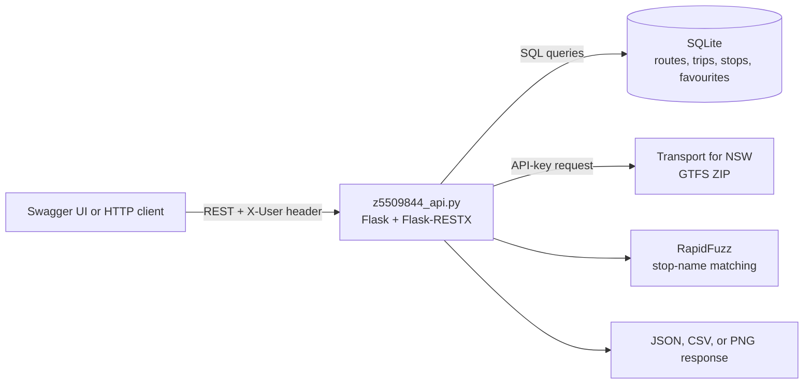

# Sydney Transit GTFS API

A Flask REST API for importing, querying, and visualising Sydney bus timetable data from the Transport for NSW GTFS feed. It combines role-aware endpoints, local persistence, fuzzy stop search, favourites, CSV export, PNG route maps, Swagger documentation, automated tests, and CI in a compact portfolio project.

> **Status:** Local portfolio and university-assignment API. The implemented endpoints and pytest suite are committed. Authentication is intentionally demonstration-grade, and a live import requires a Transport for NSW API key.

## Features

- Import a selected bus agency's GTFS ZIP from the Transport for NSW API
- Query agencies, routes, trips, stops, route trips, and trip stop sequences
- Search stop names with RapidFuzz scoring
- Apply Admin, Planner, and Commuter permissions through seeded demo identities
- Store per-user favourite routes in SQLite
- Export favourites as CSV or render their stop sequences as a PNG map
- Explore the API through Flask-RESTX Swagger UI at `/docs/`
- Exercise validation, access-control, lookup, favourites, export, and documentation paths with pytest

## Architecture



The current implementation is deliberately monolithic: route resources, database setup, GTFS ingestion, queries, and rendering live in `z5509844_api.py`. This keeps the assignment easy to run while making a future service-layer refactor straightforward.

## Tech Stack

| Area | Technology |
| --- | --- |
| API | Python, Flask, Flask-RESTX, Flask-CORS |
| Data | SQLite, Pandas, SQLAlchemy |
| Search and charts | RapidFuzz, Matplotlib, Seaborn, Plotly |
| Delivery | pytest, GitHub Actions |

## Run Locally

Python 3.11 is used by the CI workflow.

```powershell
git clone https://github.com/Hrithik028/Sydney-Transit-GTFS-API.git
cd Sydney-Transit-GTFS-API
python -m venv .venv
.\.venv\Scripts\Activate.ps1
python -m pip install -r requirements.txt
Copy-Item .env.example .env
python z5509844_api.py
```

Open `http://127.0.0.1:5000/docs/`. The application creates the configured SQLite database and seeds its demo users on startup.

To import live data, replace the placeholder `TRANSPORT_API_KEY` in `.env`. `DATABASE_URL` controls the local SQLite filename, while `FLASK_DEBUG=1` explicitly enables Flask debug mode. Do not enable debug mode on a shared or public network.

## Demo Users

Pass one of these values in the `X-User` request header:

| Username | Role | Intended scope |
| --- | --- | --- |
| `admin` | Admin | User management, imports, and all data operations |
| `planner` | Planner | Imports, data access, and favourites |
| `commuter` | Commuter | Data access and personal favourites |

These are trusted headers for assignment scope, not passwords or production authentication.

## Suggested API Walkthrough

1. `GET /health`
2. `GET /admin/users` with `X-User: admin`
3. `POST /gtfs/import/GSBC001` after configuring the API key
4. `GET /data/search/stops?name=Circular+Quay`
5. `POST /favourites/{route_id}`
6. `GET /visualisation/favourites/export`
7. `GET /visualisation/favourites/map`

The endpoint catalogue is also summarised in [docs/API_OVERVIEW.md](docs/API_OVERVIEW.md).

## Testing

```powershell
pytest -v
```

GitHub Actions runs the suite on Python 3.11 for pushes and pull requests to `main`. Tests use temporary database state and mocks where external GTFS access is not required.

## Screenshots

No interface screenshot is committed because this is an API-first project. Run the application and open `/docs/` to view the live, implementation-derived Swagger catalogue.

## Project Structure

```text
z5509844_api.py       Flask resources, GTFS import, SQLite queries, exports
z5509844_tests.py     API behaviour and validation tests
docs/                 Endpoint overview
.github/workflows/    Pytest CI configuration
.env.example          Public local-configuration template
requirements.txt      Runtime and test dependencies
```

## Limitations

- `X-User` trusts a caller-supplied identity and must be replaced before public deployment.
- SQLite and in-process chart rendering are intended for local demonstrations, not high concurrency.
- Live imports depend on external network access, a valid API key, and the upstream GTFS archive format.
- The API is implemented in one module rather than separated into resources, services, and repositories.
- List endpoints support bounded `limit` and `offset` parameters but do not return total-count or next-page metadata.

## Future Improvements

- Replace demo-header authentication with sessions or signed tokens
- Split HTTP resources, ingestion, database access, and visualisation into testable modules
- Add a small licensed sample feed for offline demonstrations
- Add pagination metadata and production deployment configuration

## License

Released under the [MIT License](LICENSE).
